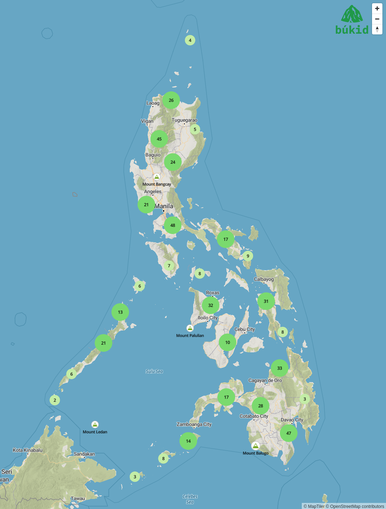

<div align="center">
  <br/>
  <a href="https://github.com/j4ckofalltrades/bukid">
    
  </a>

  <p align="center">
    <a href="https://geojson.org">
      GeoJSON
    </a>
    and
    <a href="https://github.com/topojson/topojson">
      TopoJSON
    </a>
    data for mountains in the Philippines.
  </p>
</div>

# About

> búkid - Capiznon word for mountain.

The entire dataset is available under the [data](./data) directory, including the following subsets:

- by Island Group e.g. Luzon, Visayas, Mindanao
- by Region e.g. CAR, Region VI, etc.
- by Province e.g. Capiz, Iloilo, etc.

## Visualization

- Interactive map at [bukid.vercel.app](https://bukid.vercel.app)
- View the rendered [geojson](data/geojson/_index.geojson) and [topojson](data/topojson/index.topojson) directly in GitHub
- View the GeoJSON files at [geojson.io](https://geojson.io)
- View the interactive map locally by running `npm start`



## Metadata

Metadata for each mountain can be parsed from the `properties` field.

| field       | description                                                                              | required |
|-------------|------------------------------------------------------------------------------------------|----------|
| `name`      | Name of the mountain                                                                     | required |
| `elev`      | Height in meters                                                                         | required |
| `prom`      | [Topographic prominence](https://en.wikipedia.org/wiki/Topographic_prominence) in meters | optional |
| `coord`     | Formatted coordinates                                                                    | required |
| `is_volc`   | If the mountain is a volcano or not                                                      | optional |
| `prov`      | One or more provinces where the mountain is located                                      | required |
| `region`    | One or more regions where the mountain is located                                        | required |
| `isl_grp`   | Island group where the mountain is located                                               | required |
| `alt_names` | Alternative names or spelling                                                            | optional |

### Style metadata

Metadata for styling GeoJSON data, see [simplestyle-spec](https://github.com/mapbox/simplestyle-spec).

| field           | value                  |
|-----------------|------------------------|
| `marker-color`  | #259346                |
| `marker-symbol` | mountain               |
| `marker-size`   | _depends on elevation_ |

For `marker-size` values can either be `small`, `medium`, or `large` based on the mountain's elevation, refer to the following table:

| elevation          | marker-size |
|--------------------|-------------|
| <= 500m            | small       |
| \> 500m && < 1500m | medium      |
| \>=1500m           | large       |

## Sample

GeoJSON and TopoJSON data for Mount Apo.

- GeoJSON

```json
{
  "type": "Feature",
  "geometry": {
    "type": "Point",
    "coordinates": [125.270833, 6.9875]
  },
  "properties": {
    "name": "Apo",
    "elev": 2954,
    "prom": 2954,
    "coord": "6°59′14″N 125°16′15″E",
    "is_volc": true,
    "prov": ["Cotabato", "Davao del Sur"],
    "region": ["Region XI", "Region XII"],
    "isl_grp": "Mindanao",
    "alt_names": [],
    "marker-color": "#259346",
    "marker-size": "large",
    "marker-symbol": "mountain"
  }
}
```

```geojson
{
  "type": "Feature",
  "geometry": {
    "type": "Point",
    "coordinates": [125.270833, 6.9875]
  },
  "properties": {
    "name": "Apo",
    "elev": 2954,
    "prom": 2954,
    "coord": "6°59′14″N 125°16′15″E",
    "is_volc": true,
    "prov": ["Cotabato", "Davao del Sur"],
    "region": ["Region XI", "Region XII"],
    "isl_grp": "Mindanao",
    "alt_names": [],
    "marker-color": "#259346",
    "marker-size": "large",
    "marker-symbol": "mountain"
  }
}
```

- TopoJSON

```json
{
  "type": "Topology",
  "objects": {
    "mountains": {
      "type": "GeometryCollection",
      "geometries": [
        {
          "type": "Point",
          "coordinates": [125.270832, 6.987199],
          "properties": {
            "name": "Apo",
            "elev": 2954,
            "prom": 2954,
            "coord": "6°59′14″N 125°16′15″E",
            "is_volc": true,
            "prov":  ["Cotabato", "Davao del Sur"],
            "region": ["Region XI", "Region XII"],
            "isl_grp": "Mindanao",
            "alt_names": [],
            "marker-color": "#259346",
            "marker-size": "large",
            "marker-symbol": "mountain"
          }
        }
      ]
    }
  },
  "arcs": [],
  "bbox": [125.227721, 6.541396, 125.409816, 7.36793]
}
```

```topojson
{
  "type": "Topology",
  "objects": {
    "mountains": {
      "type": "GeometryCollection",
      "geometries": [
        {
          "type": "Point",
          "coordinates": [125.270832, 6.987199],
          "properties": {
            "name": "Mount Apo",
            "elev": 2954,
            "prom": 2954,
            "coord": "6°59′14″N 125°16′15″E",
            "is_volc": true,
            "prov": ["Davao del Sur", "Cotabato"],
            "region": ["Region XI", "Region XII"],
            "isl_grp": "Mindanao",
            "alt_names": [],
            "marker-color": "#259346",
            "marker-size": "large",
            "marker-symbol": "mountain"
          }
        }
      ]
    }
  },
  "arcs": [],
  "bbox": [125.227721, 6.541396, 125.409816, 7.36793]
}
```

## Contributing

This is by no means an exhaustive list, so contributions are more than welcome.
Please read and follow the [contribution guidelines](CONTRIBUTING.md).

## Stats


